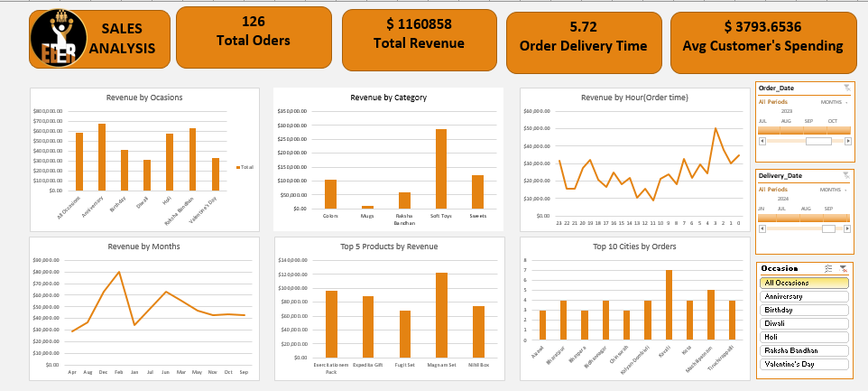

# Ferns & Petals Sales Performance Analysis

**Enterprise Portfolio Project | Retail & E-Commerce Business Intelligence**


---

## Business Problem and Context

Ferns & Petals (FNP) operates within the gifting and retail sector, where customer demand is heavily driven by seasonal events, holidays, and special occasions. Operating at scale generates thousands of daily sales transactions, but raw transactional data alone provides limited strategic value without structured synthesis.

Management required a centralized Business Intelligence solution capable of answering operational and strategic questions:

- What is the total revenue trajectory across sales cycles?
- Which product categories and specific SKUs generate the highest margin and revenue?
- Which customer occasions (e.g., Birthdays, Anniversaries) drive peak demand?
- How are orders geographically distributed across core customer cities?
- What is the average order fulfillment and delivery duration?
- What is the distribution of average customer expenditure per order?

Without an integrated analytics framework, evaluating these metrics required manual aggregation across disparate records. This project resolves that operational friction by consolidating raw sales data into an interactive executive reporting dashboard.

---

## Dashboard Preview and Interactive Features



### Key Dashboard Components

- **Executive KPI Ribbon:** Real-time visibility into Total Revenue, Total Orders, Average Delivery Time, and Average Customer Spend.
- **Category & Occasion Performance:** Multi-bar charts isolating revenue distribution across gifting occasions and product categories.
- **Temporal Trend Analysis:** Line charts mapping monthly sales trajectories and peak purchasing hours.
- **Geographic & Product Rankings:** Ranked tables evaluating top 5 revenue-generating products and top 10 cities by order density.
- **Cross-Filtering Slicers:** Dynamic user controls for filtering metrics by Order Date, Delivery Date, and Occasion.

---

## Technical Architecture and Analytics Workflow

The analysis followed a rigorous 5-stage analytics workflow:

```text
Data Ingestion
      ↓
Cleaning & Validation
      ↓
Feature Engineering
      ↓
Aggregation & Modeling
      ↓
Dashboard Deployment
```

### 1. Data Cleaning and Quality Assurance

- Addressed missing values and verified column-level data types.
- Executed duplicate record checks and normalized categorical fields.
- Standardized date formatting to enable time-series slicing.

### 2. Feature Engineering

Created derived analytical fields to enable deeper segmentation:

- **Temporal Metrics:** Isolated Month Name, Day of Week, and Hour of Purchase from raw timestamps.
- **Logistics Performance:** Engineered Delivery Duration (Delivery Date minus Order Date).
- **Financial Aggregates:** Derived line-item total revenue and customer spending buckets.

### 3. Data Modeling and Visualization

- Constructed structured Pivot Tables to aggregate core business metrics.
- Designed dynamic Pivot Charts formatted for executive scannability.
- Integrated global Slicers to allow multi-dimensional data exploration without altering underlying tables.

---

## Executive Summary and Key Performance Indicators

### Primary Metrics

| Metric | Description | Operational Significance |
|---|---|---|
| **Total Revenue** | Aggregate monetary value of all completed sales | Measures core business financial scale |
| **Total Orders** | Total volume of completed customer transactions | Tracks order processing throughput |
| **Average Delivery Time** | Mean order fulfillment duration (days/hours) | Evaluates supply chain & logistics efficiency |
| **Average Customer Spend** | Mean transaction value per check (AOV) | Measures purchasing power & basket size |

---

## Core Analytical Insights

### Occasion-Driven Demand Spikes

Sales performance is heavily concentrated around key seasonal occasions. Demand forecasting must adjust dynamically leading up to peak gifting calendar dates.

### Product Revenue Concentration

Revenue exhibits a Pareto distribution, with a top tier of 5 high-performing SKUs generating a disproportionate share of total revenue.

### Geographic Order Density

Customer orders are heavily clustered in top tier-1 cities, highlighting primary markets for logistical optimization.

### Logistics Variance

Delivery fulfillment duration varies noticeably across geographic regions, pointing to potential regional supply chain bottlenecks.

---

## Strategic Recommendations for Management

### Inventory Alignment

Prioritize safety stock and warehousing space for top-performing product categories ahead of high-volume gifting occasions.

### Promotional Bundling

Package lower-volume SKUs with high-performing products to increase Average Order Value (AOV).

### Targeted Marketing

Direct occasion-specific ad spend toward top-tier revenue-generating cities to maximize conversion rates.

### Logistics Optimization

Review fulfillment workflows in cities experiencing higher-than-average delivery lead times.

---

## Repository Structure

```text
fnp-sales-performance-analysis/
├── README.md                           # Main project documentation
├── LICENSE                             # MIT Open Source License
├── .gitignore                          # Standard Git ignore rules
├── assets/
│   ├── fnp-dashboard.png               # High-resolution dashboard screenshot
│   └── FERNS Executive Summary.pdf     # Comprehensive written business report
├── dataset/
│   └── FNP Sales Dataset.xlsx          # Raw transaction data
└── workbook/
    └── FNP Sales Dashboard.xlsx        # Fully interactive Excel dashboard workbook
```

---

## Executive Documentation

For a detailed business report covering the full analytical methodology, exploratory data tables, and extended recommendations, refer to the executive project documentation:

**Executive Summary Report:** `assets/FERNS Executive Summary.pdf`

---

## How to Access and Reproduce

### Clone the Repository

```bash
git clone https://github.com/YOUR-USERNAME/fnp-sales-performance-analysis.git
```

### Execute the Workbook

1. Open `workbook/FNP Sales Dashboard.xlsx` in Microsoft Excel 2016 or newer.
2. Utilize the built-in slicers to interactively filter sales performance across dates and occasions.

---

## License

Distributed under the MIT License. See `LICENSE` for details.
